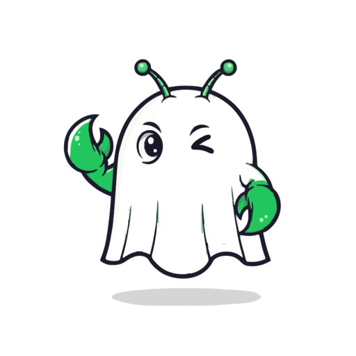

<p align="center">
  
</p>

<h1 align="center"><strong>Ghost</strong>Claw</h1>
<p align="center"><em>your silent co-worker</em></p>

<p align="center">
  <a href="https://ghostclaw-site.vercel.app">Live Site</a> &nbsp;·&nbsp;
  <a href="https://github.com/b1rdmania/ghostclaw">Main Repo</a>
</p>

---

Landing page for [GhostClaw](https://github.com/b1rdmania/ghostclaw) - a personal AI agent that lives on bare metal.

Built with the [GhostClaw Brand Kit](https://github.com/b1rdmania/ghostclaw). Fredoka 400-700, Comic Sans for chaos moments. Colors derived from the mark SVG.

## Stack

- Static HTML + CSS (no build step)
- Deployed on Vercel
- Auto-deploys from `main`

## Local

```bash
open index.html
```

## Licence

MIT
